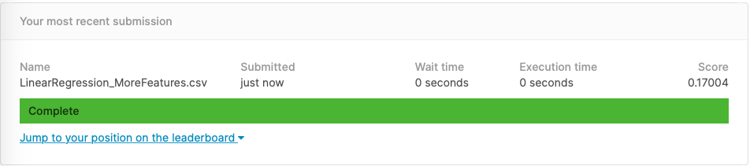

# kaggle-house-price-regression

This is my first project using Spark with Scala and IntelliJ IDE. This is really just for learning and for getting comfortable on developing and building a Scala project. I could have achieved my goal even without using an IDE (e.g. use the terminal and/or text editor), but I am curious about IntelliJ so I used it here.

I participated in the Kaggle Knowledge Competition about [House Prices: Advanced Regression Techniques](https://www.kaggle.com/c/house-prices-advanced-regression-techniques) and used their datasets (put them inside the `data/` folder). The goal of the competition is to predict the sales price for each house. The models are evaluated using Root-Mean-Squared-Error (RMSE), which means that the lower the value, the better -- the predictions are close to the actual house prices.

### Versions

- IntelliJ IDEA 2020.1.3
- scala = 2.11.12
- spark = 2.4.5

### How to build (create the jar file)
This assumes that you are using IntelliJ IDE. This part is similar to using `sbt assembly` command if you are using the sbt plugin.
1. File -> Project Structure -> Artifacts -> + -> JAR -> "From modules with dependencies...". 

2. Fill in the information and make sure to tick the box: "Include in project build". Same as shown in the picture below:

    

3. Click OK. Then "Build Project". It will generate the jar file inside the `out/artifacts/`.
    
### How to run using spark
Again, this assumes that you are using IntelliJ IDE. This part is similar to using `spark-submit` command if you have spark in your machine.

1. Run -> Edit Configurations... -> + -> Application
2. Name it "spark-submit", just for ease of  understanding.
    * Main class: `org.apache.spark.deploy.SparkSubmit`
    * VM options: `-Dspark.master=local[2]`
    * Program arguments: `--class <name_of_class> <location_of_jar_file> args`, example:
    ```
    --class kaggle.houseprice.HPRegression /<location_path>/out/artifacts/kaggle_house_price_jar/kaggle_house_price.jar data/train.csv data/test.csv data/sample_submission.csv tmp/submission
    ```
    
    It looks like this:

    

3. Click OK. Run "spark-submit". It will generate the CSV file inside the `tmp/submission/`, which you can submit to Kaggle.

### Kaggle submission
* Check the RMSE of the `sample_submission.csv`
    
* Trial submission using Linear Regression with one feature.
    
* Linear Regression with more features: combination of numerics and categories.
    
* Linear Regression with more features: combination of numerics and categories + hyperparameter tuning via cross-validation.
    

### References:
* [Spark MLlib](http://spark.apache.org/docs/latest/ml-tuning.html#model-selection-aka-hyperparameter-tuning)
* [Scala Titanic example](https://databricks-prod-cloudfront.cloud.databricks.com/public/4027ec902e239c93eaaa8714f173bcfc/19095846306138/45566022600459/8071950455163429/latest.html)
* [Kaggle Scala Titanic example](https://github.com/raywu60kg/spark-scala-kaggles)
* [Configure Scala Script in IntelliJ IDE to run a spark standalone script through spark-submit](https://stackoverflow.com/questions/28834018/configure-scala-script-in-intellij-ide-to-run-a-spark-standalone-script-through)
* [Standalone Spark application in IntelliJ](https://stackoverflow.com/questions/57259426/standalone-spark-application-in-intellij)